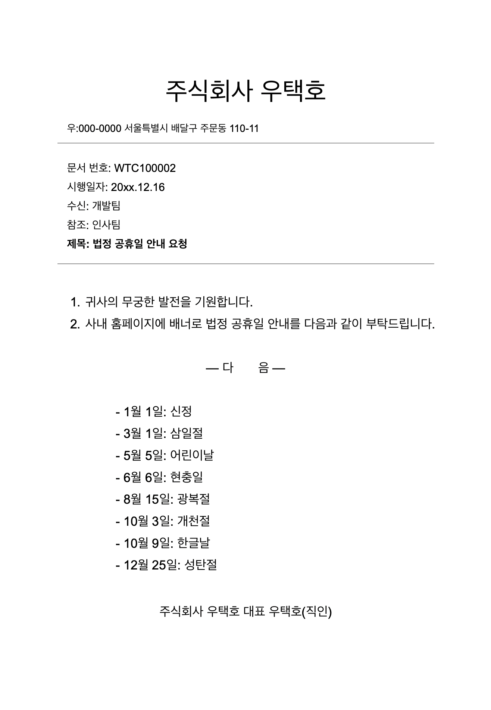

# 미션 - 개발자 비상근무

> [!NOTE]  
> 이 코드는 원래 [java-oncall-6](https://github.com/woowacourse-precourse/java-oncall-6)에서 제공된 **Java 기반의 개발자 비상근무**을 **Python**에 맞게 변환한 과제입니다. 프로젝트 구조, 요구 사항, 기능 구현 방식은 원본 저장소를 바탕으로 Python 환경에 맞추어 수정하였습니다.
> 

## 🔍 진행 방식

- 미션은 **기능 요구 사항, 프로그래밍 요구 사항, 과제 진행 요구 사항** 세 가지로 구성되어 있다.
- 세 개의 요구 사항을 만족하기 위해 노력한다. 특히 기능을 구현하기 전에 기능 목록을 만들고, 기능 단위로 커밋 하는 방식으로 진행한다.
- 기능 요구 사항에 기재되지 않은 내용은 스스로 판단하여 구현한다.

## 📮 미션 제출 방법

- **개인 GitHub**에 본 미션 저장소를 **Fork & Clone**하여 프로젝트를 진행합니다.
- 기능 구현을 완료한 후, **Pull Request**를 통해 최종 제출합니다.  
   (자세한 방법은 각자 협업 환경에 따라 결정하셔도 됩니다.)
- 제출 후, 필요하다면 추가로 의견을 교환하거나, 간단한 피드백을 주고받을 수 있습니다.

## 🚨 과제 제출 전 체크 리스트 - 0점 방지

- 기능 구현을 모두 정상적으로 했더라도 **요구 사항에 명시된 출력값 형식을 지키지 않을 경우 0점으로 처리**한다.
- 기능 구현을 완료한 뒤 아래 가이드에 따라 테스트를 실행했을 때 모든 테스트가 성공하는지 확인한다.
- **테스트가 실패할 경우 0점으로 처리**되므로, 반드시 확인 후 제출한다.

### 테스트 실행 가이드

- **Python 3.9 이상**이 설치되어 있는지 확인합니다.
  - 터미널(또는 명령 프롬프트)에서 `python --version` 또는 `python3 --version` 명령어로 확인할 수 있습니다.
- **pytest**를 활용해 테스트를 실행합니다.  
  예) 
  ```bash
  pytest
  ```
- 아래와 같은 형태로 모든 테스트가 **통과**해야 합니다.
  ```
  =========================== test session starts ============================
  ...
  ========================= 100% passing in Xs =============================
  ```

---

## 🚀 기능 요구 사항

<우택호> 배달 주문 서비스의 서버 개발을 맡고 있는 개발 팀장 수아는 한 가지 고민이 있습니다. 어떻게 하면 효율적으로 인력을 배치하여 장애를 탐지하고 신속히 대응할 수 있을지에 관한 것입니다.

얼마 전 항저우 아시안 게임과 같이 배달 주문이 급증할 것으로 예상되는 상황에 대비하여, 서비스 장애를 최소화하고 사용자의 불편을 줄이기 위해 경기 일정마다 개발자를 배치했습니다. 당시에는 비상 대응 인력이 부족해서 경기 일정마다 같은 인원이 반복적으로 대기할 수밖에 없었습니다.   

다행히 이제는 비상 대응 인력이 확보되어, 본격적으로 효율적인 장애 대응을 준비하려고 합니다. 먼저 담당 개발자가 가장 빠르게 대응할 수 있도록, '월별 비상근무표'를 편성할 계획이에요. 매번 비상근무표를 만드는 데 들어갈 리소스를 줄이기 위해, 이를 자동화할 수 있는 시스템을 개발하려고 합니다.   

아래의 요구사항을 충족하는 비상근무표 생성 프로그램을 만들어주세요.

```
비상 근무를 배정할 월과 시작 요일을 입력하세요> 5,월
평일 비상 근무 순번대로 사원 닉네임을 입력하세요> 준팍,도밥,고니,수아,루루,글로,솔로스타,우코,슬링키,참새,도리
휴일 비상 근무 순번대로 사원 닉네임을 입력하세요> 수아,루루,글로,솔로스타,우코,슬링키,참새,도리,준팍,도밥,고니

5월 1일 월 준팍
5월 2일 화 도밥
5월 3일 수 고니
5월 4일 목 수아
...
```

### 비상 근무일 배정 규칙
- 기본적으로 순번에 따라 비상 근무일을 배정한다.
- 회사에서는 평일과 휴일(토요일, 일요일, 법정공휴일) 비상 근무 순번을 다르게 운영하고 있다.
- 평일 순번과 휴일 순번의 순서는 다를 수 있다.
- 비상 근무자는 평일 순번, 휴일 순번에 각각 1회 편성되어야 한다.
  - 잘못된 예시: 수아가 두 번 편성된 경우
    ```
    평일 순번: 수아, 루루, 글로, 솔로스타, 수아, 슬링키, 참새, 도리, 준팍, 도밥, 고니
    ```
- 근무자 보호와 비상 근무 운영의 효율을 위해, 비상 근무자는 어떤 경우에도 연속 2일은 근무할 수 없다.   
  순번상 특정 근무자가 연속 2일 근무하게 되는 상황에는, 다음 근무자와 순서를 바꿔 편성한다.    
  예를 들어, 수아가 평일인 목요일에 비상 근무를 서고, 다음 날인 금요일이 휴일이면서 순번상 또다시 수아가 근무해야 할 경우,    
  다음 휴일 근무자와 순서를 바꿔서 근무한다.
  - 예시)
    - 평일 순번: 준팍,도밥,고니,수아,루루,글로,솔로스타,우코,슬링키,참새,도리
    - 휴일 순번: 수아,루루,글로,솔로스타,우코,슬링키,참새,도리,준팍,도밥,고니
    - 근무 예시: 준팍(월요일),도밥(화요일),고니(수요일),수아(목요일),루루(금요일/휴일),수아(토요일/휴일),...    
        

- 만약에 법정공휴일인 수요일에 수아가 비상 근무를 서고 다음 날 평일 순번이 수아인 경우에는,   
  다음 평일 근무자와 순서를 바꿔서 근무한다.
  - 예시)
    - 평일 순번: 준팍,도밥,수아,루루,글로,솔로스타,우코,슬링키,참새,도리,고니
    - 휴일 순번: 수아,루루,글로,솔로스타,우코,슬링키,참새,도리,준팍,도밥,고니
    - 근무 예시: 준팍(월요일),도밥(화요일),수아(수요일/휴일),루루(목요일),수아(금요일),루루(토요일/휴일),글로(일요일/휴일),...    
         

- 비상 근무자 배정 시 다음 근무자와 순서를 바꿔야 하는 경우에는, 앞의 날짜부터 순서를 변경해야 한다.    

### 비상 근무자 배정 관련 참고 문서



### 입출력 요구 사항

- 월(숫자)과 시작 요일(일, 월, 화, 수, 목, 금, 토) 정보를 입력받는다.
- 연도는 고려하지 않으며, 매년 2월은 28일까지만 있다고 가정한다.
- 평일 비상 근무 순서를 입력받는다.
- 휴일(토요일, 일요일, 법정공휴일) 비상 근무 순서를 입력받는다.

```
비상 근무를 배정할 월과 시작 요일을 입력하세요> 5,월
평일 비상 근무 순번대로 사원 닉네임을 입력하세요> 준팍,도밥,고니,수아,루루,글로,솔로스타,우코,슬링키,참새,도리
휴일 비상 근무 순번대로 사원 닉네임을 입력하세요> 수아,루루,글로,솔로스타,우코,슬링키,참새,도리,준팍,도밥,고니
```

- 올바르지 않은 입력을 할 경우 `[ERROR]`로 시작하는 에러 메시지를 출력 후 다시 입력받는다.
- 비상 근무를 배정할 월과 시작 요일의 입력 값이 올바르지 않은 경우, '비상 근무를 배정할 월과 시작 요일'부터 다시 입력받는다.
```
비상 근무를 배정할 월과 시작 요일을 입력하세요>
[ERROR] 유효하지 않은 입력 값입니다. 다시 입력해 주세요.
비상 근무를 배정할 월과 시작 요일을 입력하세요>
```
- 평일 순번 또는 휴일 순번의 입력 값이 올바르지 않은 경우, '평일 순번'부터 다시 입력 받는다.
```
비상 근무를 배정할 월과 시작 요일을 입력하세요> 1,금
평일 비상 근무 순번대로 사원 닉네임을 입력하세요> 준팍,도밥,고니,수아,루루,글로
휴일 비상 근무 순번대로 사원 닉네임을 입력하세요> 수아,수아,글로,고니,도밥,준팍
[ERROR] 유효하지 않은 입력 값입니다. 다시 입력해 주세요.
평일 비상 근무 순번대로 사원 닉네임을 입력하세요>
```


### 출력 요구 사항

- 평일이면서 법정공휴일의 경우에만 요일 뒤에 (휴일) 표기를 해야 한다.
- 비상 근무표 출력을 완료하면 프로그램은 종료된다.

```
5월 1일 월 준팍
5월 2일 화 도밥
5월 3일 수 고니
5월 4일 목 수아
5월 5일 금(휴일) 루루
5월 6일 토 수아
5월 7일 일 글로
5월 8일 월 루루
5월 9일 화 글로
5월 10일 수 솔로스타
5월 11일 목 우코
5월 12일 금 슬링키
5월 13일 토 솔로스타
5월 14일 일 우코
5월 15일 월 참새
5월 16일 화 도리
5월 17일 수 준팍
5월 18일 목 도밥
5월 19일 금 고니
5월 20일 토 슬링키
5월 21일 일 참새
5월 22일 월 수아
5월 23일 화 루루
5월 24일 수 글로
5월 25일 목 솔로스타
5월 26일 금 우코
5월 27일 토 도리
5월 28일 일 준팍
5월 29일 월 슬링키
5월 30일 화 참새
5월 31일 수 도리
```

---

## 🎯 프로그래밍 요구 사항

- **Python 3.9 이상**에서 실행 가능해야 합니다.  
   - 이 버전을 충족하지 않아 정상 동작하지 않을 경우 **0점 처리**됩니다.
- 프로그램 실행의 시작점은 `main.py`의 `main()` 함수라 가정합니다.
- **외부 라이브러리**를 사용하지 않습니다.  
   - 프로젝트 내 `requirements.txt` 또는 `Pipfile` 등에 다른 라이브러리를 추가하지 말아 주세요.
- [PEP8](https://peps.python.org/pep-0008/) Python 코드 스타일 가이드를 준수하며 프로그래밍합니다.
- 프로그램 종료 시 `sys.exit()`를 호출하지 않습니다.
- 프로그램 구현이 완료된 뒤, 제공된 **pytest** 기반 테스트 코드를 실행했을 때 모든 테스트가 성공해야 합니다.  
   - **테스트가 실패할 경우 0점 처리**됩니다.
- 프로그래밍 요구 사항에서 달리 명시하지 않는 한 파일, 패키지 이름을 수정하거나 이동하지 않습니다.
- indent(인덴트, 들여쓰기) depth를 3이 넘지 않도록 구현합니다. 2까지만 허용합니다.
   - 예: `while`문 안에 `if`문이 있는 경우 들여쓰기는 2단계가 됩니다.  
   - 힌트: indent(인덴트, 들여쓰기) depth를 줄이는 좋은 방법은 함수(또는 메서드)를 분리하면 됩니다.
- **3항 연산자(삼항 연산)**(`x if condition else y`)를 사용하지 않습니다.
-  **함수(또는 메서드)의 길이**가 15라인을 넘지 않도록 구현합니다.  
    - 함수가 한 가지 일만 하도록 최대한 작게 만들어주세요.
- pytest를 이용하여 본인이 정리한 기능 목록이 정상 동작함을 테스트 코드로 확인합니다.
-  **`else` 예약어**를 사용하지 않습니다.  
    - 힌트: `if` 조건에서 바로 return(또는 예외 발생) 시키면 `else`를 쓰지 않아도 됩니다.
    - `else`가 필요하면 로직을 더 잘게 분리해 보세요.
-  **도메인 로직**에 대해서는 단위 테스트 코드를 작성해 주세요. 단, **UI 로직**(`input`, `print` 등)은 테스트 대상에서 제외합니다.  
    - 핵심 로직을 구현하는 코드와 UI를 담당하는 로직을 분리해 구현합니다.
-  **잘못된 값**을 입력받은 경우, **`ValueError`**(또는 적절한 예외)를 발생시키고, 에러 메시지를 **"[ERROR]"** 로 시작해 출력한 뒤, 그 단계부터 **다시 입력**을 받도록 구성합니다.

---

## ✏️ 과제 진행 요구 사항

- 미션은 [python-oncall](https://github.com/swthewhite-lab/python-oncall) 저장소를 비공개 저장소로 생성해 시작한다.
- **기능을 구현하기 전 `docs/README.md`에 구현할 기능 목록을 정리**해 추가한다.
- **Git의 커밋 단위는 앞 단계에서 `docs/README.md`에 정리한 기능 목록 단위**로 추가한다.
    - [커밋 메시지 컨벤션](https://gist.github.com/stephenparish/9941e89d80e2bc58a153) 가이드를 참고해 커밋 메시지를 작성한다.
- 과제 진행 및 제출 방법은 [프리코스 과제 제출](https://docs.google.com/document/d/1cmg0VpPkuvdaetxwp4hnyyFC_G-1f2Gr8nIDYIWcKC8/edit?usp=sharing) 문서를 참고한다.
- **`docs/how-to-solve.md`에서 미션 해결 전략 문항에 답변을 필수로** 작성한다.   
